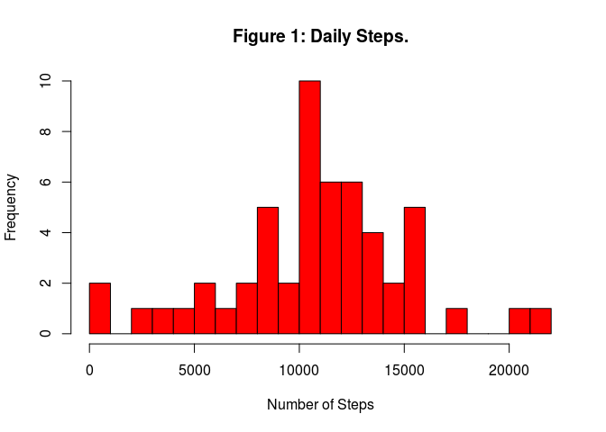
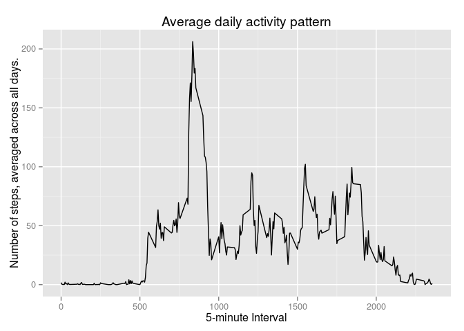
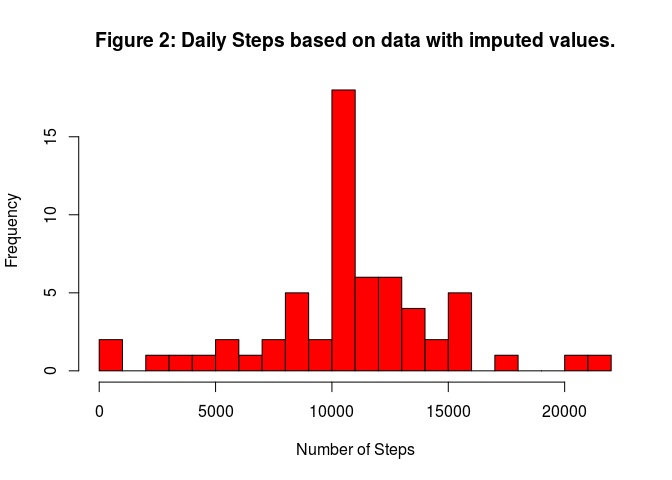

# Reproducible Research: Peer Assessment 1

## Loading and preprocessing the data

Uncompress and read the activity data.

```r
data <- read.csv(unz("activity.zip", "activity.csv"))
```

Some libraries are required for processing and plotting.

```r
require(plyr)
require(ggplot2)
```

## What is the mean total number of steps taken per day?

First, we calculate the total number of steps taken per day.


```r
steps_by_day <- ddply(data, ~date, summarize, steps=sum(steps))
steps_by_day <- steps_by_day[!is.na(steps_by_day$steps),]
head(steps_by_day, na.rm=T)
```

```
##         date steps
## 2 2012-10-02   126
## 3 2012-10-03 11352
## 4 2012-10-04 12116
## 5 2012-10-05 13294
## 6 2012-10-06 15420
## 7 2012-10-07 11015
```

The following histogram shows the total number of steps taken each day.


```r
hist(steps_by_day$steps, breaks = 30, col="red", xlab="Number of Steps", main="Figure 1: Daily Steps.")
```

 

The mean and median of steps taken per day are:


```r
mean(steps_by_day$steps)
```

```
## [1] 10766.19
```


```r
median(steps_by_day$steps)
```

```
## [1] 10765
```


## What is the average daily activity pattern?

A time series plot of the 5-minute interval (x-axis) and the average number of steps taken, averaged across all days (y-axis).


```r
steps_by_interval <- ddply(data, ~interval, summarise, mean = mean(steps, na.rm = T))

p <- ggplot(steps_by_interval, aes(interval, mean)) + geom_line()
p <- p + ggtitle("Average daily activity pattern")
p + xlab("5-minute Interval") + ylab("Number of steps, averaged across all days.")
```

 

The 5-minute **interval that** on average across all the days in the dataset **contains the maximum number of steps** is **835**.

## Imputing missing values

There are a number of days/intervals where there are missing values (coded as 'NA').


```r
missing <- is.na(data$steps)
```

The **total number of missing values** in the dataset is **2304**.

We define an imputation function that replaces missing values with the mean for the missing five minute interval among all days. We use the function to create new dataset:


```r
impute <- function(x) { replace(x, is.na(x), mean(x, na.rm = TRUE)) }
imputed = ddply(data, ~ interval, transform, steps = impute(steps))

imputed_steps_by_day <- ddply(imputed, ~date, summarize, steps=sum(steps))
imputed_steps_by_day <- imputed_steps_by_day[!is.na(imputed_steps_by_day$steps),]
```

The mean and median total number of steps taken per day:

```r
mean(imputed$steps, na.rm = TRUE)
```

```
## [1] 37.3826
```

```r
median(imputed$steps, na.rm = TRUE)
```

```
## [1] 0
```

Using the mean value for imputing missing values should not affect calculated mean.  
While the median can be affected when mean and median differ much, this does not seem to be the case here.

The following figure shows the total number of steps taken each day.


```r
hist(imputed_steps_by_day$steps, breaks = 30, col="red", xlab="Number of Steps", main="Figure 2: Daily Steps based on data with imputed values.")
```

 
